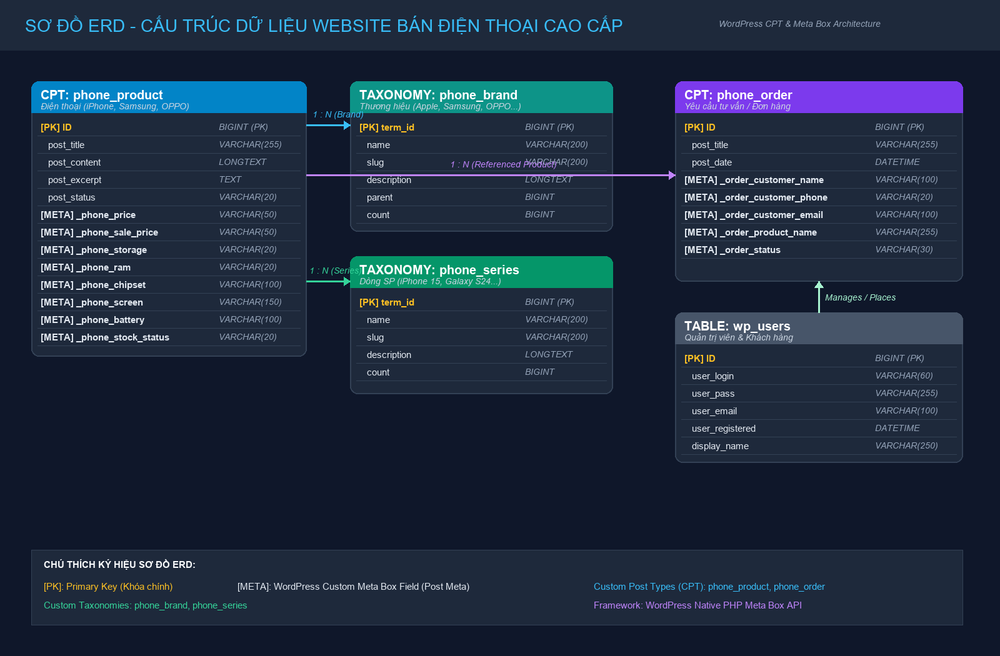
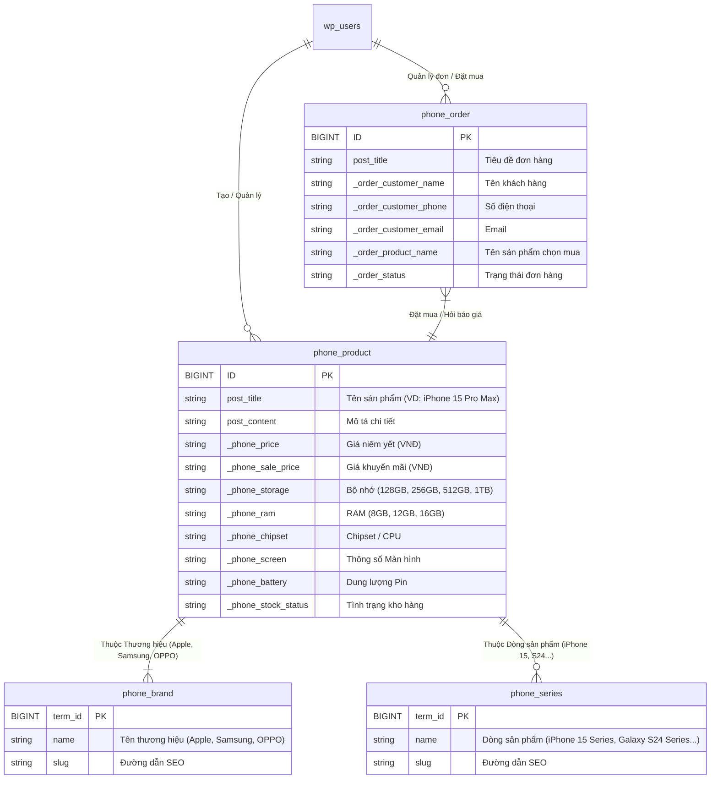

# WordPress Data Architecture - Website Bán Điện Thoại Cao Cấp (iPhone, Samsung, OPPO)

Dự án hoàn thiện **Khung xương dữ liệu (Data Architecture)** cho Website Bán Điện Thoại Cao Cấp sử dụng **WordPress Custom Plugin** được viết bằng mã PHP thuần (Native WordPress API).



---

## 1. Sơ Đồ ERD (Entity-Relationship Diagram)

### Sơ đồ dạng Mermaid



---

## 2. Danh Sách Custom Post Types (CPT) & Taxonomies

### A. Custom Post Types (CPT)
1. **`phone_product` (Điện thoại)**:
   - Slug: `/dien-thoai/`
   - Dashicon: `dashicons-smartphone`
   - Supports: Title, Editor (Gutenberg), Thumbnail, Excerpt, Revisions.
   - Rest API: Kích hoạt (`show_in_rest = true`).
2. **`phone_order` (Đơn Hàng / Tư Vấn)**:
   - Slug: N/A (Admin only)
   - Dashicon: `dashicons-cart`
   - Supports: Title, Revisions.

### B. Custom Taxonomies
1. **`phone_brand` (Thương hiệu)**:
   - Phân loại danh mục (Hierarchical = true): Apple (iPhone), Samsung, OPPO, Xiaomi, Vivo.
2. **`phone_series` (Dòng sản phẩm)**:
   - Phân loại thẻ (Hierarchical = false): iPhone 15 Series, Galaxy S24 Series, Reno Series.

---

## 3. Danh Sách Custom Meta Boxes (PHP Native)

### Meta Box Sản phẩm (`phone_product`)
| Meta Key | Tên trường | Kiểu dữ liệu | Ví dụ / Giá trị |
| :--- | :--- | :--- | :--- |
| `_phone_price` | Giá niêm yết | Number | `29990000` |
| `_phone_sale_price` | Giá khuyến mãi | Number | `27490000` |
| `_phone_storage` | Bộ nhớ trong | Select | `128GB`, `256GB`, `512GB`, `1TB` |
| `_phone_ram` | Dung lượng RAM | Select | `8GB`, `12GB`, `16GB`, `24GB` |
| `_phone_chipset` | Chip vi xử lý | Text | `Apple A17 Pro` |
| `_phone_screen` | Màn hình | Text | `6.7 inch Super Retina XDR OLED` |
| `_phone_battery` | Dung lượng Pin | Text | `4422 mAh, Sạc 20W` |
| `_phone_stock_status` | Trạng thái kho | Select | `instock` (Còn hàng), `outofstock` (Hết hàng), `preorder` (Đặt trước) |

### Meta Box Đơn Hàng (`phone_order`)
| Meta Key | Tên trường | Kiểu dữ liệu | Ví dụ / Giá trị |
| :--- | :--- | :--- | :--- |
| `_order_customer_name` | Tên khách hàng | Text | `Nguyễn Văn A` |
| `_order_customer_phone` | Số điện thoại | Text | `0912345678` |
| `_order_customer_email` | Email khách hàng | Email | `nguyenvana@gmail.com` |
| `_order_product_name` | Sản phẩm chọn | Text | `iPhone 15 Pro Max 256GB` |
| `_order_status` | Trạng thái | Select | `pending` (Mới nhận), `contacted` (Đã tư vấn), `completed` (Hoàn thành), `cancelled` (Hủy) |

---

## 4. Hướng Dẫn Cài Đặt Trên LocalWP / WordPress

1. Thư mục plugin nằm tại: `wp-content/plugins/phone-store-cpt/`.
2. Đăng nhập vào Admin WordPress Dashboard -> **Plugins** -> **Installed Plugins**.
3. Tìm plugin **"Phone Store Custom Post Types & Meta Boxes"** và nhấn **Activate**.
4. Hai menu mới sẽ xuất hiện trên thanh Admin sidebar:
   - 📱 **Điện Thoại** (Thêm sản phẩm, chọn Thương hiệu, nhập giá & thông số kỹ thuật).
   - 🛒 **Đơn Hàng / Tư Vấn** (Quản lý các yêu cầu mua hàng & tư vấn).

---

## 5. Hướng Dẫn Push Lên GitHub Repo

Chạy các lệnh Git sau trong Terminal tại thư mục dự án `WP`:

```bash
# 1. Khởi tạo Git Repo (nếu chưa có)
git init

# 2. Add remote repository GitHub của nhóm bạn
git remote add origin https://github.com/YOUR_USERNAME/YOUR_REPO_NAME.git

# 3. Tạo commit
git add .
git commit -m "feat: complete Data Architecture with custom plugin phone-store-cpt and ERD diagram"

# 4. Đẩy mã nguồn lên GitHub (branch main)
git branch -M main
git push -u origin main
```
