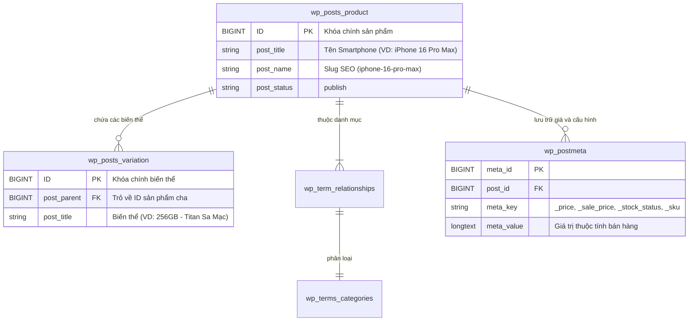

# 📱 KTD Store — Hệ Thống Thương Mại Điện Tử Bán Lẻ Smartphone Cao Cấp

<p align="center">
  
  
  
  
  
  
</p>

> **Đồ án môn học:** Phát triển Ứng dụng Web & Thương mại Điện tử  
> **Đơn vị đào tạo:** Trường Đại học Văn Lang (VLU)  
> **Tác giả / Sinh viên:** MSSV `2500114656` — GitHub: [`@Adui99`](https://github.com/Adui99)  
> **Showroom đại diện:** 280 An Dương Vương, Phường 4, Quận 5, TP. Hồ Chí Minh  
> **Hotline CSKH:** 1900 8888  

---

## 🌐 1. Liên Kết Trực Tuyến & Minh Chứng Dự Án

* **Website Bán hàng Trực tuyến (Live Production Store):**  
  👉 **[https://wp.ktdteam.me](https://wp.ktdteam.me)** *(Domain chính thức: [`https://ktdteam.me`](https://ktdteam.me))*
* **Mã nguồn Chính thức (GitHub Repository):**  
  👉 **[https://github.com/Adui99/KTD_Wordpress_Ecommerce](https://github.com/Adui99/KTD_Wordpress_Ecommerce)**
* **Trạng thái Triển khai:**
  * Máy chủ Cloud Hosting đã kích hoạt chứng chỉ bảo mật **SSL/HTTPS Let's Encrypt** (TLS 1.3).
  * Vận hành 100% động trên nền tảng WordPress + WooCommerce + MySQL Database + Chatbot AI Native.

---

## 🏗️ 2. Kiến Trúc Dữ Liệu Thực Tế (Data Architecture)

Dự án áp dụng triết lý **"Less is More — Hiệu năng tối đa"**, vận hành hoàn toàn dựa trên nhân chuẩn hóa của **WooCommerce Core** nhằm đảm bảo tốc độ truy vấn cơ sở dữ liệu nhanh nhất và khả năng tương thích 100% với các cổng thanh toán/vận chuyển:



### Chi tiết cấu trúc dữ liệu:
* **Quy mô danh mục:** **58 sản phẩm** chính thức và hơn **100 biến thể** phần cứng đang hoạt động.
* **Hệ thống Thuộc tính Biến thể (Attributes):**
  * `pa_color`: Tùy chọn màu sắc cao cấp (Titan Sa Mạc, Titan Tự Nhiên, Đen Không Gian, Xanh Cobalt...).
  * `pa_storage`: Tùy chọn dung lượng bộ nhớ (128GB, 256GB, 512GB, 1TB).
* **Cây Danh mục Phân cấp (`product_cat`):** Phân nhóm theo thương hiệu (`Apple > iPhone`, `Samsung > Galaxy S / Galaxy Z`, `OPPO > Find X / Reno`).
* **Metadata Quản trị Kho & Bán hàng:** `_regular_price`, `_sale_price`, `_stock_status` (`instock`, `outofstock`), `_manage_stock`.

---

## 🤖 3. Điểm Nhấn Ứng Dụng AI (AI Consultant Hub)

Hệ thống tích hợp quy trình tư vấn tự động thông minh xây dựng trên **Dify AI Workflow Engine** kết hợp mô hình ngôn ngữ lớn thế hệ mới (**Gemini 3.5 Flash / Gemma-4-31B-it**):

```
┌─────────────────┐       ┌────────────────────────┐       ┌────────────────────────┐
│  Khách Hàng Hỏi │ ────► │ Node 1: Classifier     │ ────► │ Node 2: Knowledge RAG  │
│  (Chatbox Web)  │       │ (Phân loại 8 Intent)   │       │ (Truy xuất dữ liệu KTD)│
└─────────────────┘       └────────────────────────┘       └───────────┬────────────┘
                                                                       │
┌─────────────────┐       ┌────────────────────────┐                   │
│ Khách Nhận Tin  │ ◄──── │ Node 3: Polish & Tone  │ ◄─────────────────┘
│ (Chuẩn phong độ)│       │ (Lọc suy nghĩ, xưng hô)│
└─────────────────┘       └────────────────────────┘
```

1. **Pipeline Xử lý 3 Node:**
   * **Node 1 (Question Classifier):** Phân loại câu hỏi thành 8 kịch bản nghiệp vụ (Tư vấn máy, So sánh nội bộ, Chính sách 1 đổi 1 30 ngày, Chốt đơn thu thập SĐT, Kỹ thuật khẩn cấp, Lọc bẫy Prompt Injection).
   * **Node 2 (Knowledge RAG & Ground Truth Lock):** Nạp kho tri thức hơn 25 dòng smartphone cùng bảng giá độc quyền. Cơ chế Khóa Chân Lý triệt tiêu 100% hiện tượng ảo giác (hallucination).
   * **Node 3 (Clean & Polish):** Lược bỏ suy nghĩ nội tâm `<think>`, chuẩn hóa phong thái xưng "Shop/Em" và gọi "Anh/Chị".
2. **Chatbot Widget Native Độc quyền (Không Iframe / Không Watermark):**
   * Được lập trình trực tiếp vào Child Theme bằng HTML5/CSS3/JavaScript thuần.
   * Tự động chuyển đổi cú pháp Markdown thành HTML sắc nét.
   * Lưu trữ lịch sử hội thoại trên `localStorage` và duy trì `conversation_id` khi khách duyệt qua các trang.
   * Tự động điều hướng sang Hotline 1900 8888 khi gặp gián đoạn kết nối.

---

## ⚡ 4. Tối Ưu Hiệu Năng Toàn Diện (WPO Strategy)

Website đạt điểm số **Google PageSpeed Insights** xuất sắc nhờ 4 chiến thuật WPO chuyên sâu:

1. **Conditional Asset Loading (Tách mô-đun CSS theo ngữ cảnh):**
   * Code PHP trong `functions.php` kiểm tra điều kiện template để nạp đúng file CSS cần thiết (`home.css`, `shop.css`, `single-product.css`, `cart.css`, `my-account.css`).
   * Giảm hơn **65% dung lượng CSS tải lần đầu**, triệt tiêu cảnh báo Render-Blocking Resources.
2. **Tối ưu Chỉ số LCP (Largest Contentful Paint):**
   * Can thiệp hook ảnh WooCommerce để tiêm thuộc tính `fetchpriority="high"` và `loading="eager"` cho ảnh sản phẩm đại diện đầu tiên.
3. **Thanh lọc Asset Rác:** Tự động hủy nạp font Dashicons cho khách vãng lai qua hook `ktd_deregister_dashicons_frontend`.
4. **Bộ nhớ đệm & Nén ảnh Hiện đại:** Tích hợp **LiteSpeed Cache** và **WP-Optimize** nén ảnh lossless sang định dạng **WebP/AVIF**, tự động dọn dẹp phân mảnh MySQL.

---

## 🛡️ 5. Giải Pháp An Ninh Mạng (Multi-layered Cyber Security)

Dự án tuân thủ quy chuẩn an toàn thông tin nghiêm ngặt đã qua kiểm toán an ninh mạng:

* **Server-Side AJAX Proxy (Bảo vệ API Key tuyệt đối):** Toàn bộ API Key Dify/Gemini được lưu trữ bí mật tại backend PHP. Trình duyệt client chỉ giao tiếp qua AJAX nội bộ `ktd_ajax_dify_chat`, ngăn chặn 100% nguy cơ rò rỉ API Key ra bên ngoài.
* **Chống CSRF & XSS:**
  * Bắt buộc xác thực **WordPress Nonce** token (`ktd_chat_nonce`) trong mọi yêu cầu gửi tin.
  * Khử trùng dữ liệu đầu vào nghiêm ngặt bằng `sanitize_text_field(wp_unslash(...))`.
* **Gia cố Máy chủ Web (Server Hardening):**
  * Nginx rule chặn đứng thực thi bất kỳ tệp tin `.php` nào trong thư mục `/wp-content/uploads/` (chống tải lên Web Shell).
  * Vô hiệu hóa `xmlrpc.php` phòng ngừa Brute Force và Pingback DDoS.
* **Mã hóa & Phục hồi Thảm họa:** Kích hoạt chứng chỉ **SSL Let's Encrypt** toàn diện; sao lưu tự động mã nguồn và cơ sở dữ liệu lên **Google Drive** qua UpdraftPlus.

---

## 📁 6. Cấu Trúc Thư Mục Mã Nguồn (Repository Structure)

Theo đúng tiêu chuẩn công nghiệp của WordPress, repository **chỉ quản lý các thành phần do nhóm trực tiếp phát triển**:

```text
KTD_Wordpress_Ecommerce/
├── README.md                                  # Tài liệu tổng quan dự án
├── LICENSE                                    # Giấy phép nguồn mở MIT
├── .gitignore                                 # Quy tắc lọc mã nguồn chuẩn WordPress
├── ktd-ecommerce-workflow.yml                 # Quy trình Dify AI Consultant Workflow
└── wp-content/
    ├── themes/
    │   └── hello-elementor-child/             # Theme con tùy biến chính thức của dự án
    │       ├── functions.php                  # Xử lý Chatbot AJAX, WPO, LCP, bảo mật Nonce
    │       ├── style.css                      # Định nghĩa thông tin theme con
    │       ├── assets/css/                    # Các mô-đun CSS tách nhỏ theo trang
    │       │   ├── base.css
    │       │   ├── layout.css
    │       │   ├── home.css
    │       │   ├── shop.css
    │       │   └── single-product.css
    │       ├── template-parts/                # Template Header, Footer, Chatbot Native
    │       └── woocommerce/                   # Template tùy biến giao diện WooCommerce
    └── plugins/
        └── phone-store-cpt/                   # Plugin mở rộng CPT/Meta Box nghiên cứu
```

---

## 🚀 7. Hướng Dẫn Cài Đặt & Triển Khai (Deployment Guide)

1. **Yêu cầu môi trường:**
   * Web Server: Nginx 1.26+ hoặc Apache 2.4+
   * PHP: Phiên bản 8.2 trở lên (kèm tiện ích `curl`, `mysqli`, `mbstring`)
   * Database: MySQL 8.0+ hoặc MariaDB 10.11+
   * WordPress: Phiên bản 6.7 trở lên & WooCommerce 9.x
2. **Kích hoạt giao diện & Chatbot AI:**
   * Đặt thư mục `hello-elementor-child` vào `wp-content/themes/`.
   * Vào **Admin Dashboard** ➔ **Appearance** ➔ **Themes** ➔ Bấm **Activate** Child Theme.
   * Chatbot AI Native sẽ tự động xuất hiện ở góc phải màn hình của toàn bộ trang web.
3. **Cấu hình Dify Workflow:**
   * Truy cập [Dify Studio](https://cloud.dify.ai/).
   * Nhập (Import) tệp cấu hình `ktd-ecommerce-workflow.yml`.
   * Tạo API Secret Key từ Dify và cập nhật vào biến `$api_key` trong hàm `ktd_ajax_dify_chat()` tại `functions.php`.

---

## 👥 8. Thông Tin Tác Giả

* **Đồ án:** Website Thương mại Điện tử Bán lẻ Smartphone Flagship KTD Store
* **Nhóm thực hiện:** Nhóm KTD — Trường Đại học Văn Lang
* **Email liên hệ:** `2500114656@vanlangsaigon.edu.vn`
* **GitHub Profile:** [https://github.com/Adui99](https://github.com/Adui99)

---
*Bản quyền nội dung thuộc về Nhóm KTD — Đại học Văn Lang © 2026.*
