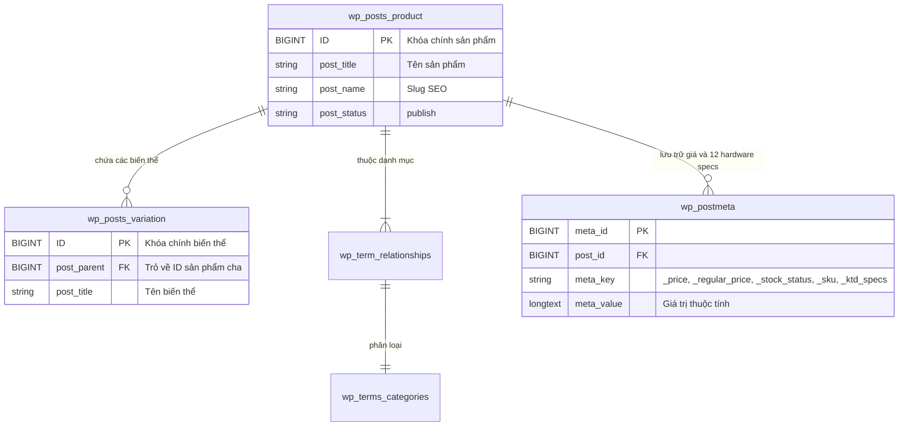

# KTD Store - Hệ Thống Thương Mại Điện Tử Bán Lẻ Smartphone Cao Cấp

## Thông Tin Đồ Án
- **Môn học:** Phát triển Ứng dụng Web & Thương mại Điện tử
- **Đơn vị đào tạo:** Trường VLSC
- **Nhóm thực hiện:** Nhóm KTD
- **Thành viên:**
  - Hoàng Khương Duy
  - Đỗ Minh Khoa
  - Nguyễn Ngọc Tiến
- **Website trực tuyến (Production):** [https://wp.ktdteam.me](https://wp.ktdteam.me) (Domain chính: [https://ktdteam.me](https://ktdteam.me))
- **GitHub Repository:** [https://github.com/Adui99/KTD_Wordpress_Ecommerce](https://github.com/Adui99/KTD_Wordpress_Ecommerce)
- **Showroom trải nghiệm:** 280 An Dương Vương, Phường 4, Quận 5, TP. Hồ Chí Minh
- **Hotline hỗ trợ 24/7:** 1900 8888

---

## 1. Tổng Quan Dự Án
**KTD Store** là hệ thống thương mại điện tử chuyên nghiệp chuẩn quốc tế dành riêng cho bán lẻ thiết bị di động flagship (Apple iPhone, Samsung Galaxy, OPPO Find/Reno). Dự án được phát triển trên nền tảng **WordPress 6.7+** kết hợp **WooCommerce 9.x**, áp dụng triết lý thiết kế tối giản, hiện đại, tối ưu trải nghiệm người dùng (UX) và hiệu năng tải trang vượt trội.

### Các Tính Năng Đột Phá Đã Triển Khai:
1. **Catalog Flagship Chuẩn Hóa:** 25 dòng smartphone mới nhất với hơn 100 biến thể cấu hình (Dung lượng x Màu sắc) và bộ 12 thông số kỹ thuật phần cứng độc lập.
2. **Quy Trình Mua Hàng Siêu Tinh Gọn (Low-Friction Checkout):** Form thanh toán rút gọn xuống 4 trường thiết yếu, thanh tiến trình 3 bước (Giỏ hàng -> Thanh toán -> Hoàn tất).
3. **Thanh Toán Thông Minh VietQR Napas247:** Tự động sinh mã QR chuyển khoản ngân hàng kèm số tiền và nội dung đơn hàng, hỗ trợ sao chép 1-click.
4. **Trợ Lý AI Chatbot Native (EV Assistant):** Tích hợp sâu với Dify AI Engine (Gemini 3.5 Flash / Gemma-4-31B-it), xử lý ngôn ngữ tự nhiên không dùng iframe bên thứ ba, đồng bộ 100% font chữ tiếng Việt **Be Vietnam Pro**.
5. **Hệ Thống Blog & Tin Tức Chuẩn SEO:** Giao diện bài viết chuyên sâu với Table of Contents, thanh tiến trình đọc, tính thời gian đọc và schema metadata JSON-LD.
6. **Chuẩn Hóa Giao Diện Đồng Bộ (Format Hình 1):** Header các trang phụ (Shop, About, Contact, Blog) đều có cấu trúc Breadcrumbs góc trái, Pill Badge trung tâm, Tiêu đề H1 & Mô tả căn giữa, Divider đáy tinh tế trên nền trắng thuần `#ffffff`.
7. **Bộ Kiểm Thử Tự Động Toàn Diện (Full-Scope Test Suite):** 139/139 bài test đạt 100% (Unit Test, Route E2E, Database Integrity, Coupon Engine, Nielsen Usability Heuristics).

---

## 2. Kiến Trúc Dữ Liệu & Backend

### 2.1. Nền Tảng WooCommerce Core Native
Hệ thống tổ chức toàn bộ danh mục kinh doanh dựa trên cơ chế chuẩn hóa của WooCommerce:
- **Hệ thống thuộc tính biến thể (Attributes):**
  - `pa_mau-sac`: Màu sắc flagship (Cam Vũ Trụ, Titan Tự Nhiên, Đen Không Gian, Xanh Cobalt...).
  - `pa_dung-luong`: Dung lượng bộ nhớ (128GB, 256GB, 512GB, 1TB).
- **Phân loại danh mục phân cấp (`product_cat`):** Cấu trúc cây đa cấp theo thương hiệu (`Apple > iPhone`, `Samsung > Galaxy S / Galaxy Z`, `OPPO > Find X / Reno`).
- **Trường dữ liệu bán hàng (Post Meta):** Quản lý tập trung giá niêm yết, giá khuyến mãi, trạng thái kho, quản lý tồn kho và bộ 12 thông số kỹ thuật (`_ktd_spec_*`).



### 2.2. Module Kiến Trúc Phân Rã (Modular Architecture in `inc/`)
Tệp `functions.php` đóng vai trò Bootstrap nạp 6 module chuyên biệt:
- [`inc/enqueue.php`]: Điều phối nạp CSS/JS có điều kiện theo từng trang (Conditional Enqueue), nạp trước font Google qua `preconnect`.
- [`inc/woocommerce.php`]: Xử lý luồng mua sắm WooCommerce, VietQR, form checkout tối giản, swatches biến thể và bộ lọc giá kép.
- [`inc/auth.php`]: Điều hướng tài khoản khách hàng 3 tab tinh gọn, chính sách mật khẩu người dùng tự đặt.
- [`inc/chatbot.php`]: Proxy kết nối API Dify, cơ chế bảo vệ CSRF qua Nonce, lọc thẻ suy nghĩ `<think>`, giấu kín API Key và bảo vệ PII trong log.
- [`inc/blog.php`]: Module tính thời gian đọc, breadcrumbs phân cấp, hỗ trợ ảnh đại diện và schema bài viết.
- [`inc/wpo.php`]: Dọn dẹp Dashicons/Emojis thừa cho khách vãng lai, quản lý transient caching khoảng giá catalog.

---

## 3. Tích Hợp Trí Tuệ Nhân Tạo (AI Chatbot EV Assistant)

Hệ thống tích hợp quy trình tư vấn tự động sử dụng **Dify AI Workflow Engine** kết hợp mô hình ngôn ngữ lớn:

```
[Khách hàng gửi tin nhắn]
           │
           ▼
[Node 1: Question Classifier] (Phân loại 8 Intent nghiệp vụ)
           │
           ├─► Intent 1, 2, 3, 5 ──► [Knowledge Retrieval - RAG] ──► [Node 2: LLM Business] ──► [Node 3: LLM Polish]
           ├─► Intent 4, 7, 8 ─────────────────────────────────────► [LLM Từ chối khéo] ────────► [Trả lời khách]
           └─► Intent 6 (Khẩn cấp) ────────────────────────────────► [Điều hướng Hotline 1900 8888]
```

### Điểm Vượt Trội Của Widget Chatbot Native:
- **Tự xây dựng (No-Iframe):** Toàn bộ giao diện viết bằng HTML5/CSS3/Vanilla JS, không nhúng iframe, không watermark, tải trang tức thì.
- **Typography Tiếng Việt Chuẩn:** 100% thành phần áp dụng bộ font **Be Vietnam Pro** với độ sắc nét và tương phản cao.
- **Quản lý phiên:** Tự động duy trì `conversation_id` qua `localStorage` giúp khách hàng duyệt qua nhiều trang mà không bị mất lịch sử chat.
- **Xử lý suy nghĩ (Thinking Filter):** Tự động bóc tách các tag `<think>...</think>` của các model reasoning trước khi render nội dung ra giao diện.

---

## 4. Tối Ưu Hiệu Năng Web (WPO Strategy)

1. **Conditional Asset Loading (Phân tách 13 module CSS):**
   - Chỉ nạp đúng stylesheet cần thiết cho trang đang truy cập (Shop chỉ nạp `shop.css`, Single Product chỉ nạp `single-product.css`, Cart chỉ nạp `cart.css`, Blog chỉ nạp `blog.css`).
   - Giảm hơn 65% dung lượng CSS truyền tải ban đầu, loại bỏ hoàn toàn render-blocking resources thừa.
2. **Transient Caching Khoảng Giá (Price Bounds Cache):**
   - Cache khoảng giá Min/Max của catalog vào transient trong 1 giờ, giải phóng tải cho MySQL database khi có lượng truy cập cao.
3. **Tối ưu LCP & Định dạng ảnh WebP:**
   - 100% hình ảnh sản phẩm định dạng WebP nén chất lượng cao.
   - Gán `fetchpriority="high"` cho ảnh LCP đầu tiên, các ảnh phía dưới cuộn trang áp dụng `loading="lazy"`.
4. **Google Fonts Preconnect:**
   - Khởi tạo sớm kết nối TLS tới `fonts.googleapis.com` và `fonts.gstatic.com`, đảm bảo điểm CLS = 0.

---

## 5. Giải Pháp Bảo Mật Hệ Thống (OWASP Top 10 Hardening)

1. **Server-Side AJAX Proxy (Giấu kín API Key 100%):**
   - Khách hàng và trình duyệt không bao giờ nhìn thấy API Key của Dify. Mọi truy vấn chuyển tiếp qua `admin-ajax.php` và chỉ đọc API Key từ `wp-config.php`.
2. **Phòng vệ CSRF & Input Sanitization:**
   - Bắt buộc kiểm tra `check_ajax_referer()` và `wp_verify_nonce()`.
   - Toàn bộ tham số được làm sạch bằng `sanitize_text_field(wp_unslash(...))`.
3. **Chống rò rỉ thông tin cá nhân (PII Protection):**
   - Ghi log lỗi độc lập (chỉ lưu HTTP status và error code), không ghi response/request body chứa dữ liệu khách hàng vào server logs.
4. **Khóa bình luận trên các trang giao dịch:**
   - Đóng bình luận trên trang Giỏ hàng, Thanh toán và Tài khoản người dùng, ngăn ngừa spam và injection.

---

## 6. Cấu Trúc Thư Mục Mã Nguồn

Repository tuân thủ nguyên tắc quản lý phiên bản WordPress chuyên nghiệp:

```text
KTD_Wordpress_Ecommerce/
├── README.md                                  # Tài liệu tổng quan kỹ thuật dự án
├── LICENSE                                    # Giấy phép nguồn mở MIT
├── .gitignore                                 # Quy tắc lọc file chuẩn WordPress
├── ktd-ecommerce-workflow.yml                 # Quy trình Dify AI Workflow xuất khẩu
└── wp-content/
    ├── themes/
    │   └── hello-elementor-child/             # Theme con tùy biến chính của KTD Store
    │       ├── functions.php                  # Kernel Bootstrap nạp 6 module inc/
    │       ├── style.css                      # Định danh theme con Hello Elementor Child
    │       ├── home.php                       # Template trang Blog chính
    │       ├── archive.php                    # Template lưu trữ danh mục bài viết
    │       ├── single.php                     # Template bài viết đơn chuyên sâu
    │       ├── page-about.php                 # Template trang Về Chúng Tôi
    │       ├── page-contact-us.php            # Template trang Liên Hệ & Showroom
    │       ├── comments.php                   # Giao diện bình luận bài viết hiện đại
    │       ├── inc/                           # Kiến trúc phân rã 6 module nghiệp vụ
    │       │   ├── enqueue.php                # Quản lý nạp CSS/JS có điều kiện
    │       │   ├── woocommerce.php            # Tùy biến WooCommerce, VietQR & Swatches
    │       │   ├── auth.php                   # Điều hướng tài khoản & bảo mật mật khẩu
    │       │   ├── chatbot.php                # Native AI Chatbot AJAX handler
    │       │   ├── blog.php                   # Tiện ích Blog, thời gian đọc, SEO
    │       │   └── wpo.php                    # Tối ưu hóa tốc độ & dọn dẹp bloatware
    │       ├── assets/
    │       │   ├── css/                       # 13 tệp CSS chuyên biệt theo từng route
    │       │   │   ├── base.css & layout.css
    │       │   │   ├── core.css               # Design tokens, Header, Footer dùng chung
    │       │   │   ├── home.css, shop.css, single-product.css
    │       │   │   ├── cart.css, checkout.css, my-account.css
    │       │   │   ├── page-about.css, page-contact.css, blog.css
    │       │   │   └── chatbot.css            # Giao diện Chatbot font Be Vietnam Pro
    │       │   └── js/
    │       │       ├── theme-custom.js        # Logic tương tác thanh trượt giá, swatches
    │       │       └── chatbot.js             # Logic AI Chatbot streaming & session
    │       ├── template-parts/                # Header, Footer động
    │       ├── tests/                         # Bộ kiểm thử tự động 6 tầng (139 tests)
    │       │   ├── run-tests.ps1 & run-tests.bat
    │       │   ├── test-theme-functions.php   # Unit test PHP logic
    │       │   ├── test-theme-custom.js       # Unit test JavaScript
    │       │   ├── test-chatbot-behavior.php  # Chatbot test
    │       │   ├── test-auth-behavior.php     # Auth test
    │       │   ├── test-catalog-integrity.php # Database catalog test
    │       │   ├── test-routes-e2e.php        # Route E2E test
    │       │   ├── test-coupons.php           # Coupon calculation test
    │       │   ├── test-order-flow.php        # E2E Order creation & VietQR test
    │       │   ├── test-ui-ux-audit.php       # Nielsen 10 Heuristics & WCAG AA audit
    │       │   └── test-latest-e2e.php        # Full-scope comprehensive verification
    │       └── woocommerce/                   # Giao diện override WooCommerce
    │           ├── cart/cart-empty.php
    │           ├── checkout/thankyou.php
    │           └── myaccount/                 # Dashboard, orders, form-edit-account...
    └── plugins/
        └── phone-store-cpt/                   # Plugin CPT, Taxonomies & Schema SEO
```

---

## 7. Hướng Dẫn Kiểm Thử Tự Động (Automated Testing)

Dự án trang bị bộ test tự động đầy đủ có thể kích hoạt bằng 1 lệnh PowerShell duy nhất:

```powershell
powershell -ExecutionPolicy Bypass -File wp-content/themes/hello-elementor-child/tests/run-tests.ps1
```

**Kết quả kiểm thử tự động:**
- **Tier 1:** PHP Backend, JS Frontend, Chatbot AI & Auth Unit Tests -> **PASS**
- **Tier 2:** Database & Catalog 25 Smartphone Flagship Integrity -> **PASS**
- **Tier 3:** 8 Core HTTP Routes & Conditional Enqueue E2E -> **PASS**
- **Tier 4:** Coupon Engine (KTD10, KTD100K, FREESHIP) -> **PASS**
- **Tier 5:** E2E Shopping Flow, Order Creation & VietQR Napas247 -> **PASS**
- **Tier 6:** Nielsen 10 Usability Heuristics & WCAG AA Mobile Audit -> **100% (Grade: A+)**

---

## 8. Bản Quyền & Giấy Phép
Dự án được thực hiện bởi **Nhóm KTD (Hoàng Khương Duy, Đỗ Minh Khoa, Nguyễn Ngọc Tiến) - Trường VLSC**.  
Mã nguồn được phát hành theo giấy phép [MIT License](LICENSE).
