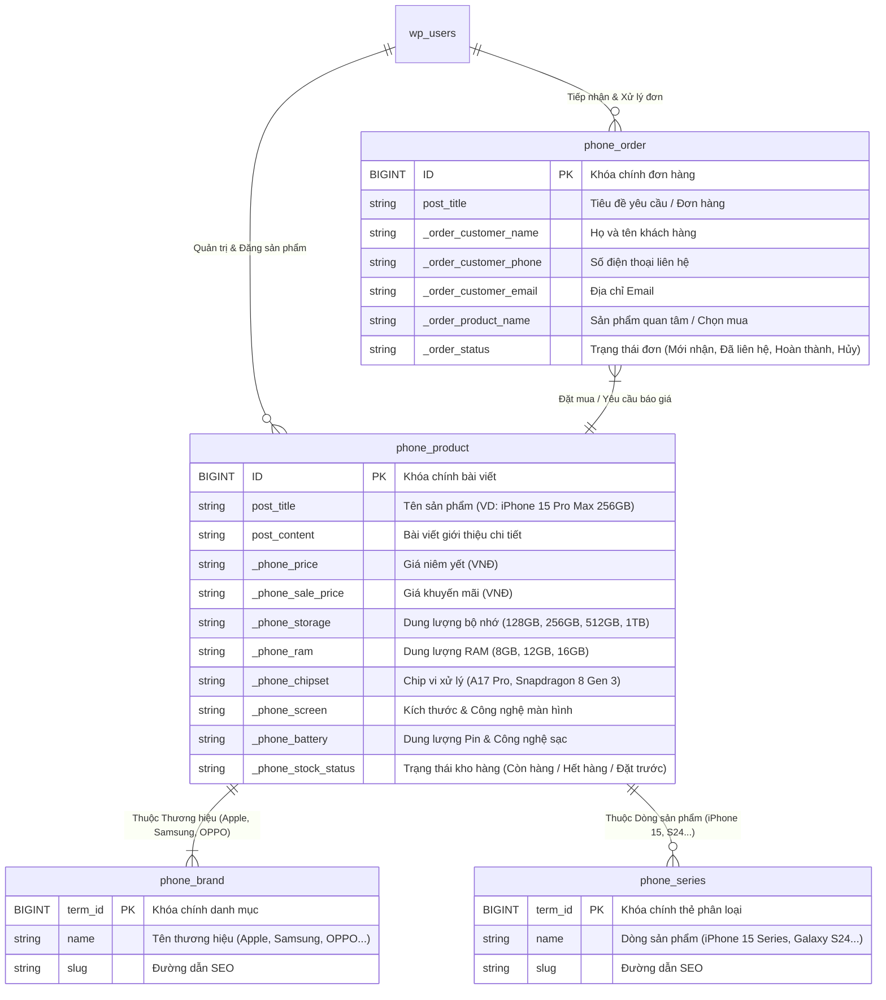

# KTD WordPress E-commerce - Website Bán Điện Thoại Cao Cấp

Dự án Xây dựng Website Thương mại Điện tử Bán Điện Thoại Cao Cấp (iPhone, Samsung, OPPO) trên nền tảng WordPress. 

Dự án bao gồm bộ định nghĩa **Kiến trúc Dữ liệu (Data Architecture)** độc lập được đóng gói thành Custom Plugin `phone-store-cpt`, giúp tối ưu hóa khả năng quản lý sản phẩm, thông số kỹ thuật và yêu cầu đơn hàng của khách hàng.

---

## 🎯 1. Tổng Quan Dự Án & Tính Năng Chính

Website được thiết kế chuyên biệt cho ngành hàng thiết bị di động cao cấp với các tính năng kiến trúc lõi:
- 📱 **Quản lý Điện thoại (CPT `phone_product`)**: Lưu trữ và hiển thị các sản phẩm smartphone đến từ các thương hiệu hàng đầu (Apple iPhone, Samsung Galaxy, OPPO Reno...).
- ⚙️ **Thông số Kỹ thuật & Giá bán (Custom Meta Box)**: Nhập liệu chi tiết Giá niêm yết, Giá khuyến mãi, Dung lượng bộ nhớ (Storage), RAM, Chip vi xử lý, Thông số Màn hình, Dung lượng Pin và Trạng thái kho hàng.
- 🏷️ **Phân loại Thương hiệu & Dòng sản phẩm (Custom Taxonomies)**:
  - `phone_brand`: Thương hiệu (Apple/iPhone, Samsung, OPPO, Xiaomi...).
  - `phone_series`: Dòng sản phẩm (iPhone 15 Series, Galaxy S24 Series, Reno Series...).
- 🛒 **Quản lý Đơn hàng & Tư vấn (CPT `phone_order`)**: Tiếp nhận thông tin khách hàng (Họ tên, SĐT, Email, Sản phẩm lựa chọn) và theo dõi trạng thái xử lý đơn hàng.

---

## 📐 2. Sơ Đồ Kiến Trúc Dữ Liệu (ERD Diagram)

Sơ đồ thể hiện mối quan hệ giữa các Thực thể (Entities), Custom Post Types, Custom Taxonomies và Custom Meta Boxes trong hệ thống:



---

## 🛠️ 3. Cấu Trúc Mã Nguồn (Repository Structure)

Mã nguồn Data Architecture được đóng gói độc lập theo dạng **Custom Plugin** để đảm bảo dữ liệu không bị mất khi thay đổi Theme giao diện:

```text
KTD_Wordpress_Ecommerce/
├── README.md
├── .gitignore
└── wp-content/
    └── plugins/
        └── phone-store-cpt/
            ├── phone-store-cpt.php               # Entry point khởi tạo Plugin
            ├── assets/
            │   └── admin-style.css               # Giao diện CSS Admin Custom Meta Box
            └── includes/
                ├── class-cpt-registrar.php       # Đăng ký CPT phone_product & phone_order
                ├── class-taxonomy-registrar.php  # Đăng ký Taxonomy phone_brand & phone_series
                ├── class-metabox-product.php     # Xử lý Meta Box cho Điện thoại
                └── class-metabox-order.php       # Xử lý Meta Box cho Đơn hàng
```

---

## 🚀 4. Hướng Dẫn Kích Hoạt Plugin

1. Clone hoặc tải mã nguồn về thư mục `wp-content/plugins/` trong dự án WordPress của bạn.
2. Đăng nhập vào trang **WordPress Admin Dashboard** ➔ **Plugins** ➔ **Installed Plugins**.
3. Tìm plugin tên **"Phone Store Custom Post Types & Meta Boxes"** và nhấn **Activate**.
4. Hai menu mới sẽ xuất hiện trên Sidebar:
   - 📱 **Điện Thoại**: Quản lý sản phẩm, thông số kỹ thuật và thương hiệu.
   - 🛒 **Đơn Hàng / Tư Vấn**: Quản lý thông tin đơn hàng khách đăng ký.
