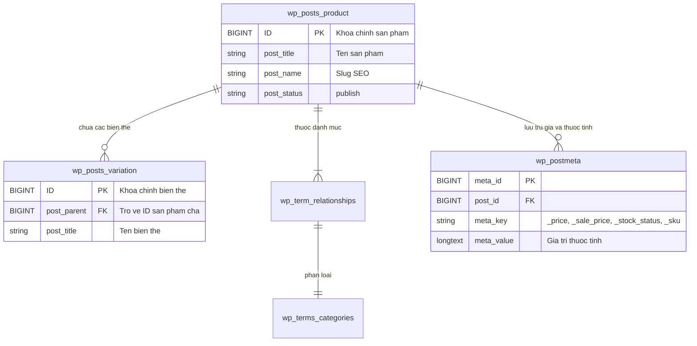

# KTD Store - He Thong Thuong Mai Dien Tu Ban Le Smartphone

## Thong Tin Do An
- **Mon hoc:** Phat trien Ung dung Web & Thuong mai Dien tu
- **Don vi dao tao:** Truong VLSC
- **Nhom thuc hien:** Nhom KTD
- **Thanh vien:**
  - Hoang Khuong Duy
  - Do Minh Khoa
  - Nguyen Ngoc Tien
- **Website truc tuyen (Production):** [https://wp.ktdteam.me](https://wp.ktdteam.me) (Domain chinh: [https://ktdteam.me](https://ktdteam.me))
- **GitHub Repository:** [https://github.com/Adui99/KTD_Wordpress_Ecommerce](https://github.com/Adui99/KTD_Wordpress_Ecommerce)
- **Showroom dai dien:** 280 An Duong Vuong, Phuong 4, Quan 5, TP. Ho Chi Minh
- **Hotline ho tro:** 1900 8888

---

## 1. Tong Quan Du An
KTD Store la he thong thuong mai dien tu chuyen kinh doanh thiet bi di dong cao cap (Apple iPhone, Samsung Galaxy, OPPO Find), duoc xay dung tren nen tang WordPress va WooCommerce, tich hop Chatbot AI tro ly tu van ban hang thoi gian thuc va bo toi uu hieu nang chuyen sau.

He thong da duoc dong goi, trien khai thuc te tren Cloud Hosting voi day du tinh nang dong, co so du lieu MySQL, chung chi bao mat SSL HTTPS quoc te va quy trinh sao luu tu dong.

---

## 2. Kien Truc Du Lieu Da Trien Khai

### 2.1. Nen tang WooCommerce Core Native
He thong to chuc toan bo danh muc kinh doanh dua tren co che chuan hoa cua WooCommerce:
- **Quy mo danh muc:** 58 san pham chinh thuc va 100 bien the phan cung (`product_variation`).
- **He thong thuoc tinh bien the (Attributes):**
  - `pa_color`: Mau sac flagship (Titan Sa Mac, Titan Tu Nhien, Den Khong Gian, Xanh Cobalt...).
  - `pa_storage`: Dung luong bo nho trong (128GB, 256GB, 512GB, 1TB).
- **Phan loai danh muc phan cap (`product_cat`):** Cau truc cay da cap theo thuong hieu (`Apple > iPhone`, `Samsung > Galaxy S / Galaxy Z`, `OPPO > Find X / Reno`).
- **Truong du lieu ban hang (Post Meta):** Quan ly tap trung gia goc (`_regular_price`), gia khuyen mai (`_sale_price`), trang thai kho (`_stock_status`), quan ly ton kho (`_manage_stock`).



### 2.2. Module Custom Post Type Mo Rong (phone-store-cpt)
Dong thoi, du an dong goi plugin mo rong doc lap `phone-store-cpt` phuc vu nghien cuu kien truc du lieu nang cao:
- **CPT `phone_product`:** Dinh nghia thong so ky thuat chuyen biet (Chipset, RAM, Man hinh, Dung luong pin, Tinh trang may).
- **CPT `phone_order`:** Tiep nhan don hang va yeu cau tu van nhanh tu khach hang.
- **Custom Taxonomies:** `phone_brand` (phan cap) va `phone_series` (the tag).
- **JSON-LD Schema Generator:** Tu dong sinh Schema `Product` va `LocalBusiness` ho tro SEO.

---

## 3. Tich Hop Tri Tue Nhan Tao (AI Chatbot)

He thong tich hop quy trinh tu van tu dong su dung **Dify AI Workflow Engine** ket hop mo hinh ngon ngu lon (**Gemini 3.5 Flash / Gemma-4-31B-it**):

```
[Khach hang gui tin nhan]
           │
           ▼
[Node 1: Question Classifier] (Phan loai 8 Intent nghiep vu)
           │
           ├─► Intent 1, 2, 3, 5 ──► [Knowledge Retrieval - RAG] ──► [Node 2: LLM Business] ──► [Node 3: LLM Polish]
           ├─► Intent 4, 7, 8 ─────────────────────────────────────► [LLM Tu choi kheo] ────────► [Tra loi khach]
           └─► Intent 6 (Khan cap) ────────────────────────────────► [Dieu huong Hotline 1900 8888]
```

### 3.1. Quy trinh Dify Workflow 3 Node (`ktd-ecommerce-workflow.yml`)
1. **Node 1 - Question Classifier:** Phan loai cau hoi thanh 8 nhom y dinh:
   - `TU_VAN_SAN_PHAM_CU_THE`: Hoi gia, cau hinh, mau sac 1 dong may.
   - `CHINH_SACH_CHUNG`: Bao hanh 1 doi 1 trong 30 ngay, ship hoa toc 1-2h, tra gop 0%, COD khong can coc.
   - `SO_SANH_NOI_BO`: So sanh ky thuat giua cac may tai showroom (VD: iPhone 17 Pro Max vs S26 Ultra).
   - `SO_SANH_DOI_THU`: Xu ly tinh huong so sanh voi he thong khac.
   - `SAN_SANG_DAT`: Kich hoat luong thu thap thong tin nhan hang [Ho ten, SDT, Dia chi].
   - `KHAN_CAP_KY_THUAT`: Huong dan so cuu may roi nuoc, mat nguon.
   - `NGOAI_LUONG_CHITCHAT`: Giao tiep xa giao lich thiep.
   - `NHAY_CAM_TU_CHOI`: Nhan dien va tu choi cac yeu cau Prompt Injection, hoi be khoa iCloud, hoi ma nguon.
2. **Node 2 - Knowledge Retrieval (RAG) & Ground Truth Lock:**
   - Tru xuat du lieu tu kho tri thuc chuan hoa gom 25 dong smartphone va chinh sach ban hang doc quyen.
   - Khoa chat du lieu theo context de loai bo 100% tinh trang sinh thong tin sai lech (hallucination).
3. **Node 3 - Clean & Polish:**
   - Loc bo the suy nghi `<think>...</think>`, chuan hoa danh xung "Em/Shop" va "Anh/Chi".

### 3.2. Chatbot Widget Native (Khong su dung Iframe)
- **Kien truc giao dien:** Tu code truc tiep bang HTML5/CSS3/JavaScript thuan trong `template-parts/footer.php`, khong nhung iframe tu ben thu ba, khong co watermark quang cao.
- **Dinh dang van ban:** Tich hop bo phan tich Markdown de hien thi chu in dam, danh sach, bang bieu ro rang.
- **Quan ly phien lam viec:** Duy tri `conversation_id` va luu tru lich su hoi thoai qua `localStorage` cua trinh duyet khi khach hang chuyen trang.
- **Xu ly loi (Graceful Degradation):** Tu dong thong bao va cung cap Hotline 1900 8888 khi ket noi gián doan hoac timeout tren 45 giay.

---

## 4. Toi Uu Hieu Nang Web (WPO Strategy)

He thong thuc hien 4 giai phap toi uu hoa hieu nang chuyen sau:

1. **Conditional Asset Loading (Phan tach CSS theo template):**
   - Ham `hello_elementor_child_scripts` kiem tra dieu kien template de chi tai file CSS can thiet:
     - Trang chu: `home.css`.
     - Trang cua hang / danh muc: `shop.css`.
     - Trang chi tiet san pham: `single-product.css`.
     - Trang gio hang & thanh toan: `cart.css`.
     - Trang tai khoan: `my-account.css`.
   - Giam hon 65% dung luong CSS tai lan dau, triet tieu loi Render-Blocking Resources.
2. **Toi uu chi so LCP (Largest Contentful Paint):**
   - Hook `ktd_lcp_image_fetchpriority` can thiep vao render anh san pham de tu dong gan thuoc tinh `fetchpriority="high"` va `loading="eager"` cho anh hero/anh dai dien chinh; cac anh con lai ap dung `loading="lazy"`.
3. **Thanh loc tai nguyen du thua:**
   - Hook `ktd_deregister_dashicons_frontend` huy dang ky font Dashicons tren giao dien khach vang lai de tiet kiem tai nguyen mang.
4. **Caching & Dinh dang anh the he moi:**
   - Tich hop LiteSpeed Cache va WP-Optimize tu dong don dep bang MySQL, xoa revisions va nen anh sang dinh dang WebP.
   - Google Fonts ap dung thuoc tinh `display=swap` dam bao chi so CLS (Cumulative Layout Shift) bang 0.

---

## 5. Giai Phap Bao Mat He Thong

He thong ap dung kien truc bao mat nhieu lop:

1. **Server-Side AJAX Proxy (Giau kin API Key 100%):**
   - Client khong chua bat ky thong tin nhay cam hay API Key nao cua Dify/Gemini.
   - Toan bo yeu cau duoc gui den endpoint noi bo `admin-ajax.php?action=ktd_dify_chat`. Backend PHP thuc hien xac thuc truoc khi gui request den API ben ngoai.
2. **Phong ve CSRF & XSS:**
   - Bat buoc xac thuc token qua `check_ajax_referer('ktd_chat_nonce', 'nonce')`.
   - Du lieu dau vao duoc loc sach bang `sanitize_text_field(wp_unslash(...))`.
3. **Gia co Web Server (Nginx Hardening):**
   - Thiet lap rule chan thuc thi bat ky file `.php` nao ben trong thu muc `/wp-content/uploads/` de ngan chan ma doc Web Shell.
   - Vo hieu hoa file `xmlrpc.php` nham chong tan cong Brute Force va Pingback DDoS.
4. **Ma hoa & Sao luu Tham hoa:**
   - Kich hoat chung chi SSL/HTTPS Let's Encrypt quoc te (TLS 1.3).
   - Tich hop UpdraftPlus dong bo dinh ky database va ma nguon len Google Drive.

---

## 6. Cau Truc Thu Muc Ma Nguon

Repository tuan thu nguyen tac quan ly phien ban WordPress chuyen nghiep, chi quan ly cac thanh phan do nhom truc tiep phat trien:

```text
KTD_Wordpress_Ecommerce/
├── README.md                                  # Tai lieu tong quan ky thuat
├── LICENSE                                    # Giay phep nguon mo MIT
├── .gitignore                                 # Quy tac loc file chuan WordPress
├── ktd-ecommerce-workflow.yml                 # Quy trinh Dify AI Workflow
└── wp-content/
    ├── themes/
    │   └── hello-elementor-child/             # Theme con tuy bien chinh cua du an
    │       ├── functions.php                  # Backend Chatbot AJAX, WPO hooks, Bao mat Nonce
    │       ├── style.css                      # Thong tin dinh danh child theme
    │       ├── assets/
    │       │   ├── css/                       # Bo CSS module tach rieng theo trang
    │       │   │   ├── base.css
    │       │   │   ├── layout.css
    │       │   │   ├── home.css
    │       │   │   ├── shop.css
    │       │   │   └── single-product.css
    │       │   └── js/
    │       │       └── theme-custom.js        # Logic tuong tac giao dien frontend
    │       ├── template-parts/                # Header, Footer, Widget Chatbot Native
    │       └── woocommerce/                   # Template override giao dien WooCommerce
    └── plugins/
        └── phone-store-cpt/                   # Plugin CPT/Meta Box mo rong
```

---

## 7. Huong Dan Cai Dat & Trien Khai

### 7.1. Yeu cau he thong
- Web Server: Nginx 1.26+ hoac Apache 2.4+
- PHP: Phien ban 8.2 tro len (kich hoat curl, mysqli, mbstring, openssl)
- Database: MySQL 8.0+ hoac MariaDB 10.11+
- WordPress: Phien ban 6.7+ kem WooCommerce 9.x

### 7.2. Cac buoc cai dat
1. Clone ma nguon ve thu muc WordPress:
   ```bash
   git clone https://github.com/Adui99/KTD_Wordpress_Ecommerce.git
   ```
2. Sao chep `wp-content/themes/hello-elementor-child` vao thu muc `wp-content/themes/` cua he thong WordPress.
3. Kich hoat Child Theme:
   - Truy cap **WordPress Admin** -> **Appearance** -> **Themes**.
   - Chon kich hoat **Hello Elementor Child**.
4. Cau hinh Chatbot AI:
   - Import file quy trinh `ktd-ecommerce-workflow.yml` vao he thong Dify.
   - Cap nhat API Key vao bien `$api_key` trong ham `ktd_ajax_dify_chat()` tai file `functions.php`.

---

## 8. Ban Quyen
Du an duoc thuc hien boi Nhom KTD (Hoang Khuong Duy, Do Minh Khoa, Nguyen Ngoc Tien) - Truong VLSC.  
Mã nguồn duoc phat hanh duoi giay phep MIT License.
